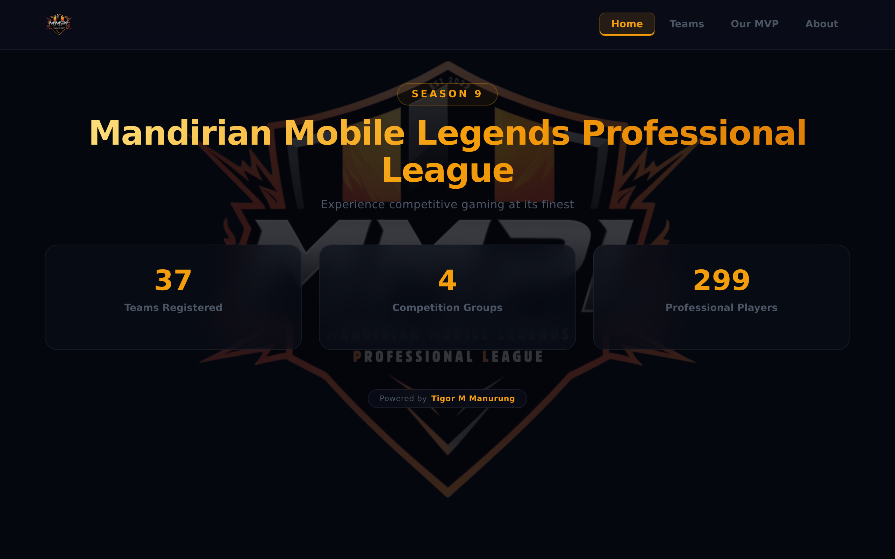
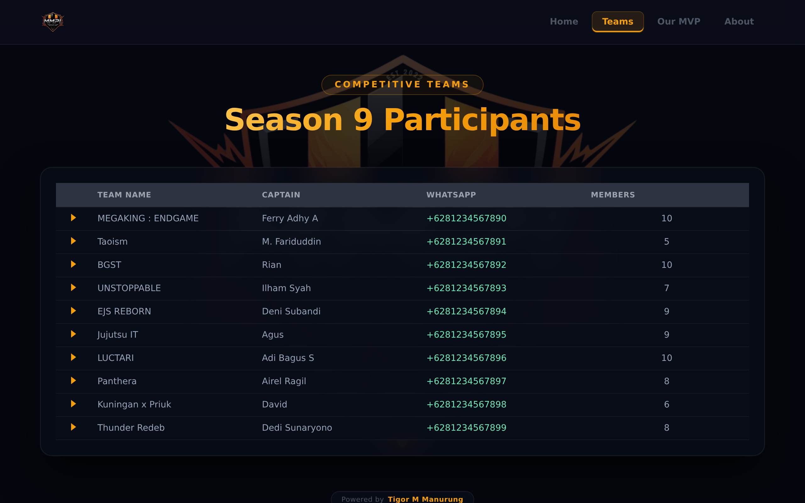
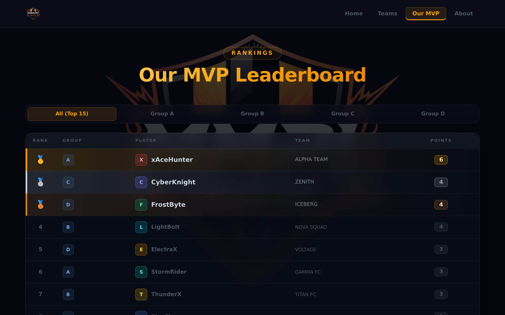
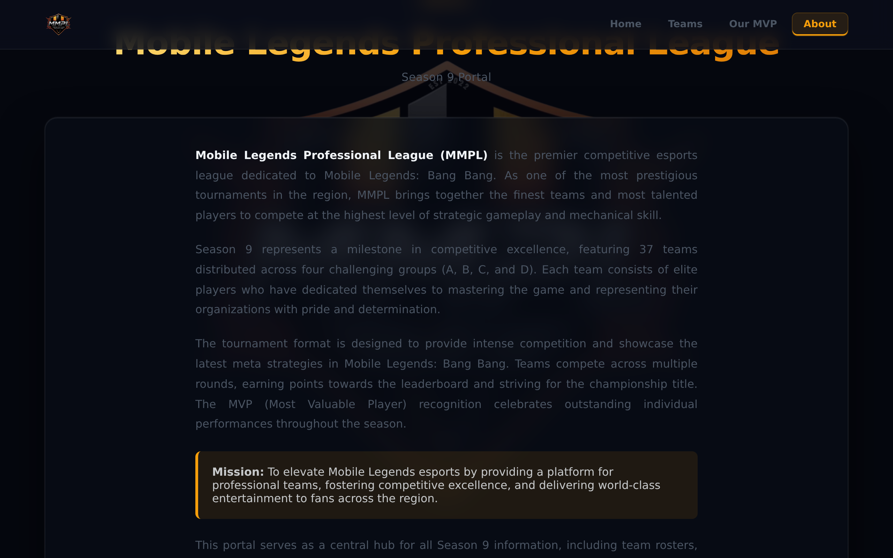
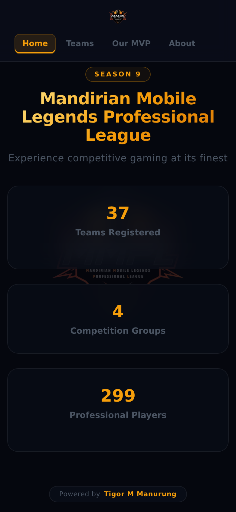
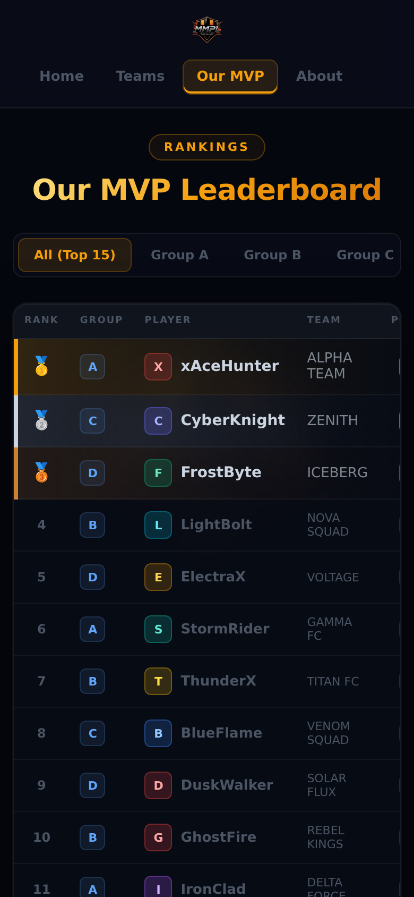

# MMPL Portal — Season 9

Portal web untuk **Mandirian Mobile Legends Professional League (MMPL) Season 9**. Menyajikan informasi tim, roster pemain, dan MVP leaderboard secara real-time.

---

## Screenshots

### Desktop

| Home | Teams |
|------|-------|
|  |  |

| MVP Leaderboard | About |
|-----------------|-------|
|  |  |

### Mobile

| Home | MVP Leaderboard |
|------|-----------------|
|  |  |

---

## Struktur File

```
portal/
├── index.html           # Main portal (Home, Teams, MVP, About)
├── teams.html           # Halaman daftar tim (standalone)
├── mvp_leaderboard.html # MVP leaderboard (standalone, dengan download)
├── mvp_input.html       # Form input hasil pertandingan (password-protected)
├── mmpl.json            # Data utama: tim, roster, & MVP log
├── match.json           # Data pertandingan per grup
└── bg.png               # Logo / background MMPL
```

---

## Halaman

### `index.html` — Main Portal
Portal utama dengan 4 halaman (SPA):

| Halaman | Konten |
|---------|--------|
| **Home** | Statistik umum: jumlah tim, grup, pemain |
| **Teams** | Tabel tim lengkap dengan expand roster anggota |
| **Our MVP** | MVP leaderboard dengan filter per grup, downloadable sebagai PNG |
| **About** | Deskripsi turnamen |

Data diambil dari `mmpl.json`.

---

### `teams.html` — Daftar Tim (Standalone)
Menampilkan tabel tim terdaftar. Data diambil dari `mmpl.json`.

---

### `mvp_leaderboard.html` — MVP Leaderboard (Standalone)
Versi standalone dari MVP leaderboard dengan fitur download PNG.  
Data diambil dari `mmpl.json`.

---

### `mvp_input.html` — Input Hasil Pertandingan
Form untuk mencatat hasil pertandingan dan MVP per match.

- Dilindungi password
- Pilih: Grup → Match → Pemenang → MVP Winner → MVP Loser
- Submit ke Google Apps Script
- Data pemain diambil dari `mmpl.json`

---

## Data

### `mmpl.json`
File data utama. Digunakan oleh `index.html`, `teams.html`, `mvp_leaderboard.html`, dan `mvp_input.html`.

```json
{
  "lastupdate": "YYYY-MM-DD HH:mm:ss",
  "teams": [
    {
      "team_name": "...",
      "captain_name": "...",
      "captain_whatsapp": "...",
      "logo": true,
      "idcard": true,
      "members": [
        {
          "full_name": "...",
          "nip": "...",
          "game_id": "...",
          "game_nick": "..."
        }
      ]
    }
  ],
  "mvp_log": [ ... ]
}
```

### `match.json`
Data jadwal & hasil pertandingan per grup (A, B, C, D).  
Saat ini hanya digunakan sebagai referensi; belum difetch langsung oleh halaman manapun.

```json
{
  "groups": {
    "A": {
      "teams": [ "..." ],
      "matches": [
        { "id": 123, "team1": "...", "team2": "...", "round": 1, "winner": null }
      ]
    }
  }
}
```

---

## Grup & Tim

| Grup | Jumlah Tim |
|------|-----------|
| A | 9 tim |
| B | 9 tim |
| C | 9 tim |
| D | 10 tim |
| **Total** | **37 tim** |

---

## Sistem Poin MVP

- **MVP pemenang** mendapat **+2 poin**
- **MVP pecundang** mendapat **+1 poin**
- Leaderboard dapat difilter per grup atau ditampilkan All (Top 15)

---

## Tech Stack

| Kategori | Teknologi | Keterangan |
|----------|-----------|------------|
| **Frontend** | Vanilla HTML5 / CSS3 / JavaScript (ES2020+) | Tanpa framework — semua SPA logic ditulis manual |
| **UI Library** | jQuery 3.7.0 | Dipakai khusus untuk integrasi DataTables |
| **Tabel Interaktif** | DataTables 1.13.6 | Search, sort, expand row pada halaman Teams |
| **PNG Export** | html2canvas 1.4.1 | Capture leaderboard DOM menjadi file PNG |
| **Tipografi** | Google Fonts — Inter | Weight 400–900 |
| **Backend** | Google Apps Script (GAS) | Endpoint penerima submit dari `mvp_input.html` |
| **Database** | Google Sheets | Penyimpanan hasil pertandingan & MVP log |
| **Static Data** | JSON file (`mmpl.json`, `match.json`) | Data tim & roster di-serve sebagai file statis |
| **Hosting** | Static file (tidak ada server) | Bisa dihosting di GitHub Pages / Netlify / lokal |

### Arsitektur Data Flow

```
Google Sheets
    ↑ (submit)          ↓ (read via GAS endpoint)
mvp_input.html    →   mvp_leaderboard.html
                       index.html (tab MVP)

mmpl.json  →  index.html (tab Teams)
           →  teams.html
           →  mvp_input.html (daftar pemain per tim)
```

---

## Benchmark Kode

### Ukuran File

| File | Baris | Ukuran |
|------|------:|-------:|
| `index.html` | 2.057 | 59 KB |
| `mvp_leaderboard.html` | 1.644 | 47 KB |
| `mvp_input.html` | 501 | 12 KB |
| `teams.html` | 577 | 9 KB |
| `mmpl.json` | 2.467 | 56 KB |
| `match.json` | 106 | 2 KB |
| `bg.png` | — | 1.023 KB |
| **Total** | **7.352** | **~1,2 MB** |

### Dependensi CDN (estimasi transfer size)

| Library | Min+Gzip |
|---------|-------:|
| jQuery 3.7.0 | ~31 KB |
| DataTables 1.13.6 (JS+CSS) | ~35 KB |
| html2canvas 1.4.1 | ~53 KB |
| Google Fonts (Inter) | ~15 KB |
| **Total CDN** | **~134 KB** |

### Estimasi Page Load (kondisi normal)

| Aset | Ukuran Transfer |
|------|---------------:|
| `index.html` | 59 KB |
| `mmpl.json` | 56 KB |
| CDN libraries | ~134 KB |
| `bg.png` (logo nav) | 1.023 KB |
| **Total first load** | **~1,27 MB** |

> `bg.png` menyumbang ~80% total transfer — bottleneck utama pada koneksi lambat.

### Kompleksitas Fungsi Kritis

| Fungsi | File | Kompleksitas |
|--------|------|-------------|
| `processMVPData()` | `index.html` | O(n) — iterasi rows sekali |
| `renderMVPTable()` | `index.html` | O(n log n) — sort + slice/filter |
| `buildExportNode()` | `index.html` | O(n) — build DOM string |
| `processData()` | `mvp_leaderboard.html` | O(n) — identik dengan `processMVPData` |
| `genMatch()` | `mvp_input.html` | O(n²) — kombinasi round-robin |
| `loadTeamsData()` | `index.html` | O(n) — render DataTables |

---

## Code Quality

### Hal yang Baik

| # | Pattern | Detail |
|---|---------|--------|
| 1 | **AbortController + timeout** | Semua fetch dilindungi timeout 15 detik — tidak menggantung selamanya |
| 2 | **Regex dikompilasi di luar loop** | `const VS_RE = /\s+vs\s+/i` didefinisikan sekali, dipakai ulang setiap row |
| 3 | **Progressive loading steps** | UI menampilkan status `step-init → step-fetch → step-calc → step-render` |
| 4 | **Retry on failure** | Semua halaman menampilkan link "Retry" jika fetch gagal |
| 5 | **`cache: 'no-store'`** | Data selalu fresh, tidak bergantung cache browser |
| 6 | **Sort stabil** | Tie-breaking alphabetical (`localeCompare`) sehingga urutan konsisten |
| 7 | **`document.fonts.ready`** | Download menunggu font siap sebelum html2canvas render |

### Masalah & Catatan

| Severity | Masalah | File | Keterangan |
|----------|---------|------|------------|
| **Medium** | Duplikasi logik MVP | `index.html` & `mvp_leaderboard.html` | `processMVPData()` dan `processData()` hampir identik — jika ada perubahan poin harus diubah di 2 tempat |
| **Medium** | `GROUP_MAP` hardcoded | `mvp_input.html` | Daftar tim per grup ditulis manual, tidak diambil dari `mmpl.json` — rawan drift jika tim berubah |
| **Medium** | `bg.png` tidak dioptimasi | — | 1 MB untuk gambar logo — sebaiknya dikonversi ke WebP atau dikecilkan |
| **Low** | `match.json` tidak dipakai | — | File ada tapi tidak difetch oleh halaman manapun |
| **Low** | Password di client-side | `mvp_input.html` | Password gate bisa dilihat via DevTools — acceptable untuk use case internal, bukan produksi |
| **Low** | `alert()` pada error download | `index.html` | Gunakan UI toast/inline error agar lebih konsisten dengan desain |
| **Low** | Tidak ada null-guard pada `find()` | `mvp_input.html:426` | Jika `team_name` tidak ditemukan di `mmpl.json`, `t.members.forEach` akan throw |
| **Info** | Semua CSS & JS inline | semua file | Tidak ada build pipeline — maintenance lebih sulit untuk file besar |

### Ringkasan Skor

| Aspek | Nilai | Catatan |
|-------|------:|--------|
| Resilience (error handling) | 8/10 | AbortController, retry, step feedback sudah baik |
| Performance | 6/10 | Bottleneck di `bg.png` 1 MB dan tidak ada lazy load |
| Maintainability | 5/10 | Duplikasi kode antar file, inline style masif di export node |
| Security | 6/10 | Password client-side; tidak ada XSS risk karena data internal |
| Consistency | 7/10 | Pola fetch & render konsisten; minor perbedaan style antar file |
| **Overall** | **6.4/10** | Solid untuk skala turnamen internal; ada ruang optimasi |

---

## Dependensi Eksternal

| Library | Versi | Kegunaan |
|---------|-------|---------|
| jQuery | 3.7.0 | DOM & DataTables |
| DataTables | 1.13.6 | Tabel interaktif |
| html2canvas | 1.4.1 | Download leaderboard sebagai PNG |
| Google Fonts (Inter) | — | Tipografi |

---

## Shortlink

Portal dapat diakses via: **https://bit.ly/mmpl_portal**
